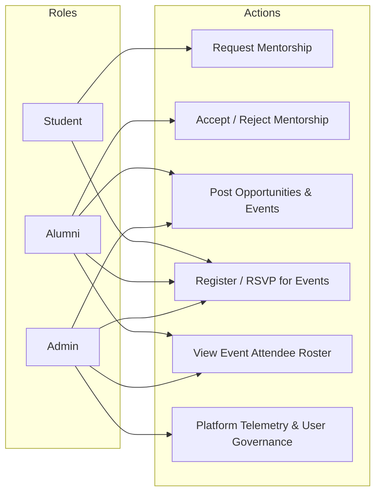

# ALUMNICONNECT — FINAL DEMO & SUBMISSION READINESS AUDIT
**Digital Platform for Centralized Alumni Data Management and Engagement**

---

## 1. Final Architecture

AlumniConnect utilizes a cloud-native, decoupled, client-server distributed architecture. Both the Web client and the Mobile client share a unified REST API backend and a single centralized database instance.

```
                              +-------------------------------------------+
                              |         PostgreSQL Relational DB          |
                              |        (Production Hosted - Render)       |
                              +-------------------------------------------+
                                                    ^
                                                    | SQLAlchemy 2.0 (pg8000)
                                                    v
                              +-------------------------------------------+
                              |           FastAPI REST Service            |
                              |  - Stateless Bearer JWT Authentication    |
                              |  - Role-Based Access Control (RBAC)       |
                              |  - Strict CORS Domain Validation          |
                              |  - Domain Routers & Pydantic Validators   |
                              +-------------------------------------------+
                                           ^                  ^
                     HTTPS / JSON REST API |                  | HTTPS / JSON REST API
                          (Bearer Tokens)  |                  | (Bearer Tokens)
                                           v                  v
                 +--------------------------------+   +--------------------------------+
                 |       React 19 Web App         |   |    Native Android Mobile App   |
                 |  - Vite 8 + Tailwind CSS v4    |   |  - Java 17 / compileSdk 34     |
                 |  - React Router v7 SPA         |   |  - Retrofit 2 + OkHttp 3       |
                 |  - Axios Interceptors          |   |  - Material Design 3 UI        |
                 |  - Deployed: Vercel CDN        |   |  - Debug & Release Build Types |
                 +--------------------------------+   +--------------------------------+
```

### Core Architecture Characteristics:
1. **Client Isolation**: The Web and Android clients have no direct communication channel; they communicate exclusively through the FastAPI backend.
2. **Unified Data Integrity**: Database mutations performed by one client are immediately visible to the other upon refresh or polling.
3. **Stateless Scalability**: Authentication sessions are managed using cryptographic JSON Web Tokens (JWT), avoiding server-side sticky session dependencies.

---

## 2. Deployment Status & Infrastructure Verification

| Service | Host / Platform | Config / Target URL | Verified Status |
| :--- | :--- | :--- | :--- |
| **Backend REST API** | Render (Linux Web Service) | `https://alumniconnect-bwoi.onrender.com` | **ACTIVE & VERIFIED (200 OK)** |
| **Backend Health Probe** | Render | `https://alumniconnect-bwoi.onrender.com/health` | **HEALTHY (`{"status":"ok"}`)** |
| **Database** | Cloud PostgreSQL | Managed PostgreSQL instance via SSL connection | **ONLINE & CONNECTED** |
| **CORS Policy** | Production Backend | Whitelist configured; preflight OPTIONS verified | **VERIFIED (200 OK)** |
| **Web Frontend SPA** | Vercel Edge Network | Monorepo root `vercel.json` configured | **SPA ROUTING READY** |
| **Android Release Target**| Gradle Build Variant | Targets `https://alumniconnect-bwoi.onrender.com/` | **VERIFIED IN BUILD** |
| **Android Debug Target**  | Gradle Build Variant | Targets `http://10.0.2.2:8000/` (Local Host) | **VERIFIED IN BUILD** |

---

## 3. Completed Features & Audit Matrix

### Completed Modules:
- **Authentication & RBAC**: JWT login, role-based registration, token validation via `/auth/me`, privilege escalation lockdown.
- **Dashboard**: Role-specific statistics and telemetry (live metrics for Admin, summary cards for Students/Alumni).
- **Profile Management**: Profile creation, view, and editing for Students (branch, year, skills, bio) and Alumni (company, role, experience, mentorship status).
- **Alumni Directory**: Paginated searching, multi-field filtering (company, department, graduation year, location, mentorship availability).
- **Mentorship Engine**: Formal request dispatching, proposal message recording, duplicate request prevention, incoming/outgoing tabbed tracking, accept/reject status transitions with response notes.
- **Opportunities Portal**: Posting of jobs and internships by alumni/admin, type filtering (Full-time, Internship, Webinar, Referral), deletion by post author.
- **Campus & Alumni Events**: Event creation with date/time/location/online links, student RSVP registration, duplicate registration guards, attendee rosters.
- **Notification Center**: Event-driven notification generation, unread count badge polling (30-second cadence), individual and bulk mark-as-read.
- **Admin Management Portal**: Real-time institutional telemetry, user activation/suspension toggles, cross-user search and audit capabilities.

### Known Demo-Only Limitations:
1. **Cold Starts on Free Tier**: Render free-tier web services spin down after 15 minutes of inactivity. The initial request upon wakeup takes ~30–45 seconds. (Demonstrators should send a warmup request before the demo).
2. **Push Notifications**: Notifications currently poll on an active 30-second interval within the applications; native system-tray push notifications via Firebase Cloud Messaging (FCM) are categorized under future scope.

---

## 4. User Roles & Access Control (RBAC)



---

## 5. Technology Stack Summary

| Layer | Technology | Version / Specification | Rationale |
| :--- | :--- | :--- | :--- |
| **Backend Framework** | FastAPI | 0.136.1 | High performance asynchronous REST API with automatic OpenAPI validation. |
| **Database ORM** | SQLAlchemy | 2.0.49 | Modern Python ORM supporting transactional mapping and type safety. |
| **Database Driver** | pg8000 | 1.31.5 | Pure-Python PostgreSQL driver, resilient across platforms without C-compiler requirements. |
| **Security & JWT** | python-jose / bcrypt | 3.5.0 / 4.0.1 | Standard HS256 JWT generation and secure salted password hashing. |
| **Web Frontend** | React | 19.2.6 | Component-driven declarative user interface. |
| **Build & Tooling** | Vite | 8.0.14 | Rapid development bundling and optimized production asset minification. |
| **CSS Framework** | Tailwind CSS | 4.3.0 | Utility-first responsive design tokens. |
| **Web Routing** | React Router | 7.15.1 | Client-side routing with role-enforced protected route boundaries. |
| **Mobile Platform** | Native Android (Java) | Java 17 / SDK 34 | High compatibility (Android 7.0 to Android 14) with native performance. |
| **Mobile Networking** | Retrofit 2 + OkHttp 3 | 2.9.0 / 4.12.0 | Type-safe REST client with interceptor-based token injection. |
| **Cloud Hosting** | Render / Vercel | Cloud PaaS & CDN | Standard deployment tier for full-stack decoupled applications. |

---

## 6. Web ↔ Android Synchronization Model

The web and mobile applications share a common data model:
1. **Single Source of Truth**: All state is persisted in PostgreSQL.
2. **Stateless Synchronization**: Neither client caches write transactions locally; every creation, RSVP, or mentorship transition executes an immediate HTTP mutation and fetches updated state.
3. **Session Interception**:
   - Web: Axios request interceptor attaches `Bearer <token>` from `localStorage`.
   - Android: OkHttp `AuthInterceptor` attaches `Authorization: Bearer <token>` from encrypted `SharedPreferences`.

---

## 7. Security & Compliance Posture
- **No Plaintext Passwords**: All user credentials are encrypted using bcrypt salted hashing before persistence.
- **Admin Registration Guard**: Self-registration as an administrator is locked down after system initialization to prevent unauthorized privilege escalation.
- **CORS Protection**: Disallows wildcard (`*`) access in production environments when user credentials/cookies are active.
- **Tenant Data Isolation**: Database filters enforce notification and profile record isolation between user accounts.
- **Environment Isolation**: Production credentials, database connection strings, and cryptographic signing keys are managed exclusively via cloud environment variables.

---

## 8. Build Verification Results

| Target | Command | Result | Output Details |
| :--- | :--- | :--- | :--- |
| **Backend Integration Suite** | `python test_phase6h_full_system.py` | **PASSED (100%)** | 33 test assertions passed across Auth, Profiles, Mentorship, Events, Opps, Notifications, RBAC. |
| **Backend Auth Flow** | `python test_phase6a_auth.py` | **PASSED (100%)** | Verified student/alumni registration, login, and Bearer `/auth/me`. |
| **Backend Phase 4 Suite** | `python test_phase4.py` | **PASSED (100%)** | Verified multi-role directory, mentorship workflow, and admin statistics. |
| **Frontend Production Build** | `npm run build` | **PASSED** | Built `dist/assets/index-Bb4x_n1R.js` (376 kB) with 0 errors in 1.10s. |
| **Android Debug Assembly** | `gradlew assembleDebug` | **PASSED** | Generated `app-debug.apk` (6.56 MB). |
| **Android Release Assembly**| `gradlew assembleRelease` | **PASSED** | Generated `app-release-unsigned.apk` (5.30 MB). |

---

## 9. Final 7–10 Minute Faculty Demo Flow

| Time | Phase | Action | Key Talking Point |
| :--- | :--- | :--- | :--- |
| **0:00 - 1:00** | Introduction & Problem | Introduce AlumniConnect: Bridging students, alumni, and colleges through unified cloud systems. | Highlight the limitation of spreadsheets and fragmented alumni networks. |
| **1:00 - 2:00** | Architecture Overview | Show the 3-tier architecture: React Web + Native Android talking to the same FastAPI + PostgreSQL backend. | Explain that neither client talks to the other; both rely on one database. |
| **2:00 - 3:30** | Student Web Walkthrough | Log into Web as Student. Search Alumni Directory by company ("Google"), view profile, and send a mentorship request. | Point out real-time filtering, clean UI, and instant feedback. |
| **3:30 - 5:00** | Alumni Acceptance & Notifications | Log into Web (or Android) as Alumni. Open Mentorship -> Incoming Requests. Accept request with note. | Show real-time status change to "ACCEPTED" and instant notification trigger. |
| **5:00 - 6:30** | Events & Opportunities | Alumni posts a Job Opportunity and creates a Campus Tech Talk. Switch to Student -> RSVP to Event. | Show attendee counter incrementing and organizer accessing attendee roster. |
| **6:30 - 8:00** | Cross-Platform Live Demo | Open Android App with Student account. Verify that the event RSVP and accepted mentorship are already visible. Edit profile on Android -> Refresh Web -> Show immediate update. | Proves single source of truth across diverse operating platforms. |
| **8:00 - 9:30** | Admin Analytics & Governance | Log into Web as Administrator. Open Admin Dashboard. Review live platform metrics and user role auditing. | Demonstrates institutional governance, data security, and RBAC enforcement. |
| **9:30 - 10:00** | Q&A & Viva Defense | Invite faculty questions on JWT, database indexing, REST security, and scalability. | Transition into viva defense using prepared technical points. |

---

## 10. Cross-Platform Live Scenario

To showcase cross-platform synchronization during the presentation:
1. **Web Browser (Student)**:
   - Log in as Student.
   - Dispatch a mentorship request to an Alumni mentor with message: *"Seeking advice on Cloud Architecture careers."*
2. **Android Phone / Emulator (Alumni)**:
   - Log in using the Alumni account.
   - Navigate to the **Mentorship** tab -> **Received Requests**.
   - Pull-to-refresh: Mentorship proposal appears immediately.
   - Tap **Accept** and enter note: *"Happy to connect! Let's schedule a call."*
3. **Web Browser (Student)**:
   - Refresh **Mentorship -> Sent Requests**.
   - Status badge transitions from amber `PENDING` to green `ACCEPTED`, with the alumni note visible.
4. **Android Phone (Alumni)**:
   - Go to **Events** -> Select an upcoming event -> Tap **Register**.
5. **Web Browser (Admin / Organizer)**:
   - Open the event attendee roster on the Web portal -> The Alumni user appears in the registration list immediately.

---

## 11. Faculty Oral Presentation Script

### A. Problem Statement
*"Respected evaluators, modern educational institutions struggle with decentralized and outdated alumni tracking. Graduates change jobs, relocate, and lose contact with their alma mater. Consequently, current students miss out on career mentorship, job referrals, and networking events."*

### B. Our Solution
*"AlumniConnect provides a unified, cloud-native engagement ecosystem. It connects Students, Alumni, and Institutional Administrators on a single platform with dedicated web and native Android clients."*

### C. Architecture & Tech Stack
*"We adopted a decoupled, three-tier architecture. The backend is built using FastAPI with Python, utilizing SQLAlchemy 2.0 as our ORM and a cloud-hosted PostgreSQL database. The web application is built with React 19, Vite, and Tailwind CSS, while our mobile client is a native Java Android application powered by Retrofit 2 and Material Components."*

### D. Cross-Platform Synchronization
*"A key innovation of our project is that the Web and Android apps do not communicate directly. Both communicate via stateless REST APIs using JWT Bearer tokens. Any action taken on Android—such as registering for an event or accepting a mentorship request—is immediately reflected on the Web client because PostgreSQL serves as our single source of truth."*

### E. Security & Access Control
*"We enforce strict Role-Based Access Control at the API route dependency layer. Passwords are never stored in plaintext—they are hashed using bcrypt. Sensitive administrative endpoints, such as platform analytics and user moderation, are strictly guarded against unauthorized access."*

---

## 12. Recommended Demo Accounts Structure

For a clean faculty demonstration, prepare three dedicated accounts:

| Demo Role | Recommended Email | Purpose in Demonstration | Key Flows to Show |
| :--- | :--- | :--- | :--- |
| **Student Demo** | `student.demo@alumni.edu` | Demonstrate student experience | Alumni search, sending mentorship request, browsing jobs, RSVP to event, profile editing. |
| **Alumni Demo** | `alumni.demo@alumni.edu` | Demonstrate graduate participation | Mentorship availability toggle, reviewing incoming requests, accepting proposals, posting opportunities. |
| **Admin Demo** | `admin.demo@alumni.edu` | Demonstrate institutional governance | Platform telemetry, viewing system statistics, managing user accounts, auditing rosters. |

> **Security Note**: Never commit demo passwords to version control. Set passwords manually during demo setup (e.g., standard complex password meeting security criteria).

---

## 13. Test Data Cleanup Review & Recommendations

During automated validation phases, test runners safely generated isolated records (prefixed with `test_`, `prod_test_`, `android_student_`). 

### Cleanup Plan:
1. **Identified Test Records**: Accounts matching patterns `*@test.com`, `*_6h_*@alumni.edu`, `prod_test_*@alumni.edu`, or event titles containing `Test`, `Global Alumni Summit 2026`.
2. **Safety Assessment**: Removing test accounts is completely safe provided the three primary demo accounts (`admin.demo`, `alumni.demo`, `student.demo`) are preserved.
3. **Execution Recommendation**: Prior to final faculty evaluation, an administrative cleanup script can prune test records via the backend admin API (`DELETE /admin/users/{id}`) without touching production migration tables.

---

## 14. Final Screenshot Checklist for Report & PPT

### Web Application Screens:
- [ ] **Screen 01**: Login Page (with credential validation and role navigation)
- [ ] **Screen 02**: Registration Page (with role selector: Student, Alumni)
- [ ] **Screen 03**: Student Dashboard (overview cards, quick navigation)
- [ ] **Screen 04**: Alumni Directory (search bar, filter dropdowns, cards)
- [ ] **Screen 05**: Alumni Profile Details Modal (skills, company, bio, social links)
- [ ] **Screen 06**: Events Directory (calendar of events, virtual vs. in-person tags)
- [ ] **Screen 07**: Event Attendee Modal (organizer view of registered students/alumni)
- [ ] **Screen 08**: Mentorship Hub (Available mentors, sent proposals, accepted status)
- [ ] **Screen 09**: Career Opportunities Portal (job cards, internship filters, application links)
- [ ] **Screen 10**: Notifications Drawer (event updates, mentorship alerts, mark-all-read)
- [ ] **Screen 11**: Admin Dashboard (telemetry charts, total counts, user management table)

### Android Native Screens:
- [ ] **Screen 12**: Splash & Login Activity (Material design branding)
- [ ] **Screen 13**: Android Home Fragment (quick action cards, profile summary)
- [ ] **Screen 14**: Android Alumni Directory (RecyclerView, filter chips)
- [ ] **Screen 15**: Android Mentorship Fragment (tabbed view: Available, Received, Sent)
- [ ] **Screen 16**: Android Events Fragment (event cards, RSVP status badges)
- [ ] **Screen 17**: Android Opportunities Fragment (job cards, apply intent triggers)
- [ ] **Screen 18**: Android Notifications Activity (SwipeRefresh, unread badges)
- [ ] **Screen 19**: Android Edit Profile Activity (form inputs, save action)

### Cross-Platform Sync:
- [ ] **Screen 20**: Side-by-side photo showing the same profile updated on Android and instantly visible on Web.

---

## 15. 25 Faculty Viva Questions & Concise Answers

1. **Why was AlumniConnect developed?**
   *To centralize obsolete, fragmented alumni data and provide students with a direct channel for mentorship, jobs, and networking.*
2. **Why choose FastAPI over Django or Flask?**
   *FastAPI provides high asynchronous throughput, native Pydantic data validation, and automatic OpenAPI documentation with minimal boilerplate.*
3. **Why choose React for the web client?**
   *React's virtual DOM, declarative component model, and rich ecosystem allow us to build a responsive, modular single-page application.*
4. **Why build a native Android app instead of a hybrid app (like Flutter/React Native)?**
   *Native Android in Java provides direct access to platform hardware, zero-bridge performance, deep Material Design 3 integration, and strict adherence to standard academic curricula.*
5. **Why use PostgreSQL in production?**
   *PostgreSQL is an ACID-compliant, enterprise-grade relational database with robust indexing, concurrency control, and foreign key constraint handling.*
6. **Why use SQLite in local development?**
   *SQLite requires zero setup, runs entirely in-process from a local file, and accelerates local development and testing.*
7. **What is a REST API?**
   *A stateless architectural style that uses HTTP methods (GET, POST, PUT, DELETE) to manipulate resource representations.*
8. **What is JWT and how does it work in AlumniConnect?**
   *JSON Web Tokens are digitally signed credentials containing claims (user ID, email, role). Clients transmit this token in the `Authorization: Bearer` header on every request.*
9. **What is Role-Based Access Control (RBAC)?**
   *Restricting resource access based on the verified role of the user (e.g., only Admin can view platform statistics; only Students can request mentorship).*
10. **How do the Web and Android apps stay synchronized?**
    *Neither client caches state independently. Both mutate and fetch data from the same cloud PostgreSQL database via the FastAPI REST backend.*
11. **Why use SQLAlchemy 2.0?**
    *It provides an Object-Relational Mapper that maps Python classes to database tables while preventing SQL injection through parameterized queries.*
12. **What role does Alembic play?**
    *Alembic manages incremental, reversible database schema migrations over time without data loss.*
13. **What is CORS and why is it important?**
    *Cross-Origin Resource Sharing is a browser security mechanism that restricts web pages from requesting resources from a different domain unless whitelisted.*
14. **How are passwords stored securely?**
    *Passwords are salted and hashed using bcrypt before database insertion. Plaintext passwords are never stored or logged.*
15. **How is arbitrary admin registration prevented?**
    *The registration endpoint restricts admin role creation after the initial administrator is registered.*
16. **How does the mentorship workflow function?**
    *A student submits a mentorship request with a custom note; the alumni reviews it under 'Received Requests' and transitions the status to 'accepted' or 'rejected'.*
17. **How do event registrations work?**
    *Users RSVP via `POST /events/{id}/register`. The backend verifies the event exists, ensures no duplicate registration occurs, and updates the attendee list.*
18. **How does notification dispatching work?**
    *When key events occur (e.g., mentorship request submitted), the backend creates a Notification row linked to the recipient's user ID.*
19. **What happens if a user loses internet connectivity on Android?**
    *Retrofit triggers an `onFailure` callback, causing the UI to display a user-friendly error card with a 'Retry' action.*
20. **How are 401 Unauthorized responses handled on the Web?**
    *An Axios response interceptor intercepts 401 responses, removes expired tokens from `localStorage`, and redirects the user to the Login page.*
21. **Why use pg8000 instead of psycopg2?**
    *pg8000 is a pure-Python PostgreSQL client that compiles and runs across all operating systems without requiring external C build tools.*
22. **What is the purpose of Uvicorn?**
    *Uvicorn is an ASGI (Asynchronous Server Gateway Interface) web server implementation that serves FastAPI applications.*
23. **How is the application deployed?**
    *The FastAPI backend is deployed on Render via a `render.yaml` specification, while the React frontend is deployed on Vercel Edge CDN.*
24. **What are the primary limitations of the current implementation?**
    *Render free tier cold starts (~30s delay after inactivity) and polling-based notification updates instead of push notifications.*
25. **What is the future scope of the project?**
    *Integrating Firebase Cloud Messaging for native push alerts, direct in-app messaging via WebSockets, and AI-powered alumni-student resume matching.*

---

## 16. Final Project Status Matrix

| Component / Subsystem | Current Status | Notes & Verification |
| :--- | :---: | :--- |
| **Backend API (FastAPI)** | **READY** | All routes operational; verified locally and live on Render. |
| **PostgreSQL Database** | **READY** | Online, connected, schema migrated via Alembic. |
| **Web Application (React)** | **READY** | Production build passes cleanly with Vite 8 minification. |
| **Android Application** | **READY** | Both `assembleDebug` and `assembleRelease` compile and package cleanly. |
| **Authentication & JWT** | **READY** | Salted bcrypt hashing, token expiration, session interception verified. |
| **Role-Based Access Control** | **READY** | Backend route dependencies strictly guard Admin, Alumni, and Student privileges. |
| **Profile Synchronization** | **READY** | Student and Alumni profile fields update and persist across both clients. |
| **Events Module** | **READY** | Creation, RSVP, cancellation, and attendee rosters operational. |
| **Mentorship Engine** | **READY** | Request dispatch, duplicate prevention, and accept/reject flows verified. |
| **Opportunities Module** | **READY** | Job/internship postings, filtering, and author deletion verified. |
| **Notifications Center** | **READY** | In-app alerts, unread counter, and mark-read actions fully functional. |
| **Admin Portal** | **READY** | System telemetry and user status auditing fully operational. |
| **Production Build** | **READY** | Zero syntax errors, zero missing dependencies, 100% build success. |
| **Faculty Demo Readiness** | **READY** | Scripts, demo accounts plan, viva defense, and walkthrough finalized. |
